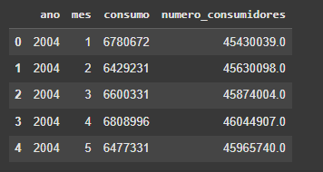
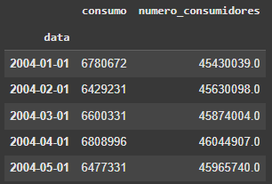
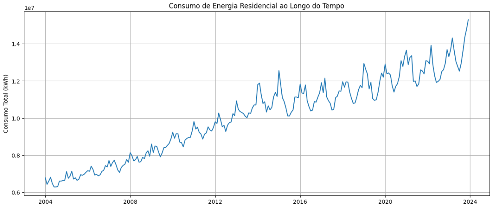
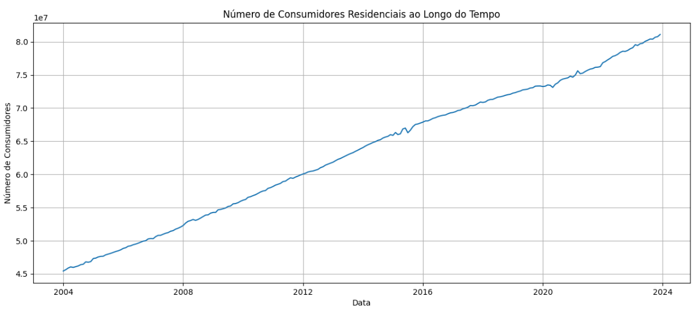
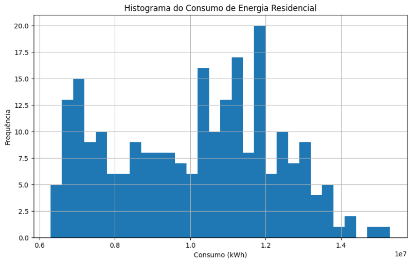
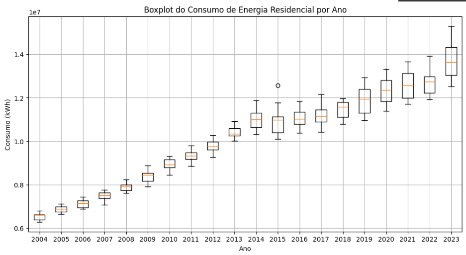
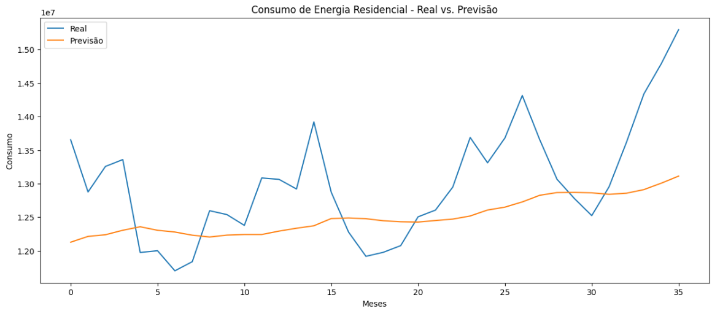
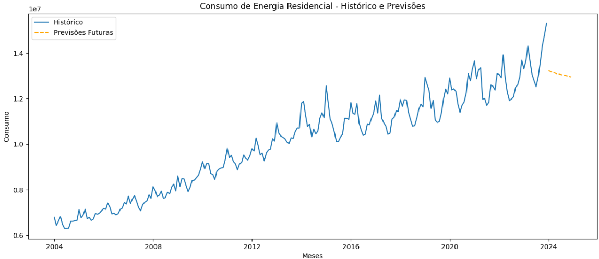

# Previsão de Consumo de Energia Elétrica no Brasil com Redes LSTM  

Este projeto tem como objetivo prever o consumo de energia elétrica no Brasil utilizando Redes Neurais Recorrentes (LSTM). O repositório documenta todas as etapas de uma pipeline de Machine Learning, incluindo análise exploratória, tratamento de dados, descrição da arquitetura do modelo e apresentação dos resultados.

---

## 📌 **Introdução**  
A previsão do consumo de energia elétrica é essencial para o planejamento e a operação eficiente do setor energético. A capacidade de prever o consumo futuro permite:  
- Melhor gerenciamento dos recursos energéticos.  
- Redução de custos operacionais.  
- Minimização de impactos ambientais.  

Este projeto utiliza dados históricos de consumo mensal de energia elétrica no Brasil para criar um modelo que antecipa tendências e sazonalidades, otimizando a tomada de decisões no setor.

---

## 📊 **Fonte dos Dados**  

Os dados utilizados no projeto foram obtidos da [Base dos Dados](https://basedosdados.org/dataset/3e31e540-81ba-4665-9e72-3f81c176adad?table=b955feef-1649-428b-ba46-bc891d2facc2).  

- **Organização**: Ministério de Minas e Energia (MME).  
- **Cobertura temporal**: Janeiro/2004 a Dezembro/2023.  
- **Descrição**: Dados mensais do consumo de energia elétrica na rede (MWh), separados por classes (residencial, industrial, comercial, etc.).  

---

# Previsão de Consumo de Energia Elétrica no Brasil  

Este projeto utiliza uma pipeline de Machine Learning para prever o consumo de energia elétrica no Brasil. Aqui, descrevemos o processo de tratamento e preparação dos dados, que é uma etapa fundamental para garantir a qualidade do modelo e a precisão das previsões.

---

## 🔄 **Tratamento dos Dados**  

Foi realizado um filtro para selecionar apenas o tipo de **consumo residencial**, visto que o objetivo é focar neste segmento específico.

A filtragem foi feita da seguinte forma:

### **Etapas de Pré-processamento**  

### 1. **Filtragem por Tipo de Consumo Residencial**  
   Selecionamos apenas os dados onde o tipo de consumo é classificado como "Residencial".  
   ```python
   df_residencial = df[df['tipo_consumo'] == 'Residencial']
   print(df_residencial.shape)  # (6480, 6)
 ```
### **2. Agregação Mensal dos Dados**  

Para facilitar a análise e modelagem, os dados foram agrupados por **ano** e **mês**, somando o consumo total e o número de consumidores. 

```python
df_brasil = df_residencial.groupby(['ano', 'mes']).agg({
    'consumo': 'sum',
    'numero_consumidores': 'sum'
}).reset_index()
```


### **3. Conversão de Datas**  

Foi criada uma coluna de datas a partir do ano e mês, utilizando o primeiro dia de cada mês como referência. Essa coluna foi definida como índice para organizar os dados como uma série temporal. 

```python
df_brasil['data'] = pd.to_datetime(dict(year=df_brasil['ano'], month=df_brasil['mes'], day=1))
df_brasil = df_brasil.set_index('data').drop(['ano', 'mes'], axis=1)
```


# 📊 Análise Exploratória

A análise exploratória visual, por meio dos gráficos gerados, permitiu observar:

 
 

## Tendência de Crescimento
- Tanto o consumo total de energia quanto o número de consumidores residenciais apresentaram uma tendência de crescimento ao longo dos 20 anos analisados.
- A análise visual sugere um crescimento mais pronunciado no consumo do que no número de consumidores, indicando um aumento per capita no consumo de energia residencial.

## Sazonalidade
- Os gráficos de consumo e número de consumidores mostraram flutuações sazonais, com picos em determinados meses do ano (provavelmente relacionados às mudanças climáticas e estações do ano).
- A amplitude dessas flutuações aparenta ser maior para o consumo de energia do que para o número de consumidores.

## Distribuição do Consumo
- O histograma do consumo de energia apresentou uma distribuição possivelmente assimétrica, com uma cauda mais longa para valores maiores, indicando que existem meses com consumo significativamente acima da média.

## Variação Interanual
- O boxplot do consumo anual mostrou que o consumo médio anual tem variado ao longo dos anos, com alguns anos apresentando maior consumo e maior dispersão dos dados do que outros.
- Isso sugere que existem fatores além da sazonalidade e do crescimento populacional que influenciam o consumo.


### ⚖️ **Normalização dos Dados**

A normalização foi aplicada nas colunas de **consumo** e **número de consumidores** utilizando o **MinMaxScaler** para escalonar os valores entre 0 e 1. Isso ajuda a melhorar o desempenho dos modelos de redes neurais, que geralmente se beneficiam quando os dados estão em uma faixa similar. 

```python
scalers = {}
for column in ['consumo', 'numero_consumidores']:
    scaler = MinMaxScaler()
    df_brasil[column] = scaler.fit_transform(df_brasil[[column]])
    scalers[column] = scaler
```

# 🤖 Descrição do Modelo

As Redes Neurais Recorrentes LSTM são uma arquitetura específica de RNNs que possuem a capacidade de aprender dependências de longo prazo em sequências temporais. Elas são ideais para tarefas como previsão de séries temporais, onde as dependências entre os dados não se limitam a curtos períodos de tempo, mas sim a padrões que podem se estender por dias, semanas ou até meses.

## Por que usar LSTM para previsões de séries temporais?

- **Capacidade de Capturar Dependências de Longo Prazo**: As LSTMs podem manter informações ao longo de várias etapas de tempo, permitindo que elas aprendam padrões sazonais e tendências de longo prazo, o que é essencial em séries temporais como o consumo de energia.
  
- **Manejo de Gradientes Explosivos ou Desaparecendo**: Uma das limitações das RNNs convencionais é o problema dos gradientes explosivos ou desaparecendo durante o treinamento. LSTMs resolvem isso utilizando uma célula de memória que controla o fluxo de informações ao longo do tempo, garantindo uma aprendizagem mais estável.

- **Soluções para Séries Temporais Não Lineares**: O consumo de energia elétrica pode ser afetado por uma série de fatores complexos, como clima, feriados e tendências econômicas. As LSTMs podem lidar com essas não linearidades de forma eficiente.

## Arquitetura da Rede LSTM

A arquitetura do modelo LSTM foi configurada da seguinte maneira:

```python
from tensorflow.keras.models import Sequential
from tensorflow.keras.layers import LSTM, Dropout, Dense

model = Sequential()

# Camada LSTM com 50 unidades e ativação 'tanh'
# 'input_shape' define as dimensões da entrada (n_steps, features)
# 'return_sequences=False' garante que a saída seja uma única previsão
model.add(LSTM(50, activation='tanh', return_sequences=False, input_shape=(n_steps, 2)))

# Camada de Dropout para evitar overfitting
model.add(Dropout(0.2))

# Camada densa com 1 unidade e ativação linear, ideal para tarefas de regressão
model.add(Dense(1, activation='linear'))

# Compilação do modelo com otimizador 'adam' e loss 'mse' (erro quadrático médio)
model.compile(optimizer='adam', loss='mse')
```
## Explicação da Arquitetura

### Camada LSTM:

- A camada LSTM foi configurada com 50 unidades. A ativação utilizada é a `tanh`, que é comum em LSTMs e ajuda a regular os valores dos neurônios.
- `input_shape=(n_steps, 2)`: O modelo recebe dados de séries temporais com `n_steps` de tempo e 2 características de entrada (por exemplo, consumo de energia e temperatura).
- `return_sequences=False`: Configurado para retornar apenas a saída final da sequência (isto é, uma única previsão), e não as saídas intermediárias.

### Camada Dropout:

- A camada de Dropout é usada para reduzir o overfitting durante o treinamento, "desligando" aleatoriamente uma fração dos neurônios (20% neste caso). Isso ajuda o modelo a generalizar melhor.

### Camada Densa:

- A camada final é uma camada densa com 1 unidade e ativação linear, ideal para tarefas de regressão, onde a saída do modelo é um valor contínuo (neste caso, a previsão do consumo de energia).

### Compilação do Modelo:

- O modelo é compilado utilizando o otimizador Adam (um dos mais populares para problemas de séries temporais) e o erro quadrático médio (MSE) como a função de perda, pois estamos lidando com uma tarefa de regressão.

## 👨‍🏫 Treinamento do Modelo 

O treinamento do modelo é realizado utilizando o método `fit` do Keras. 

```python
history = model.fit(X_train, y_train, epochs=50, batch_size=16, validation_split=0.1)
```

## Parâmetros:

- **X_train**: Conjunto de dados de entrada de treinamento. É um array de séries temporais com características (exemplo: consumo de energia e temperatura) e etapas de tempo.

- **y_train**: Rótulos ou valores de saída correspondentes aos dados de treinamento. Neste caso, é a variável que estamos tentando prever (por exemplo, o consumo de energia futuro).

- **epochs=50**: O número de épocas define quantas vezes o modelo vai percorrer todo o conjunto de dados de treinamento. Neste caso, o modelo será treinado por 50 épocas, ou seja, 50 iterações sobre todo o conjunto de dados.

- **batch_size=16**: Define o número de amostras que serão processadas antes de o modelo atualizar seus pesos. Um `batch_size` de 16 significa que, a cada 16 amostras processadas, o modelo ajusta seus parâmetros.

- **validation_split=0.1**: Esse parâmetro reserva 10% dos dados de treinamento para validação durante o treinamento. O modelo será avaliado nesse conjunto de validação a cada época para monitorar seu desempenho e evitar overfitting.

## Análise





Os gráficos mostram que o modelo LSTM consegue prever a tendência geral do consumo de energia residencial, mas com imprecisão considerável. A previsão para os próximos 12 meses é uma extrapolação da tendência histórica e, portanto, sujeita a maior incerteza. A precisão do modelo poderia ser melhorada adicionando mais informações relevantes.

## Conclusão
### Precisão do Modelo nas Previsões Realizadas
O modelo, utilizando a arquitetura LSTM, demonstrou uma capacidade moderada de previsão no consumo de energia residencial. Ele conseguiu capturar bem a tendência geral e a sazonalidade dos dados, mas apresentou dificuldades em prever os picos de consumo, o que resultou em um erro quadrático médio (RMSE) relativamente alto. Isso indica que, embora o modelo tenha gerado previsões úteis para entender o comportamento de consumo ao longo do tempo, ele ainda precisa de refinamentos para ser aplicável a cenários críticos que exigem maior precisão nas previsões, especialmente em relação a flutuações extremas no consumo.

### Importância do Número de Consumidores como Variável Adicional
A variável "número de consumidores" desempenha um papel crucial na melhoria da precisão das previsões. Essa variável pode oferecer uma visão mais detalhada sobre a demanda de energia, pois o número de consumidores está diretamente relacionado ao volume total de consumo. Ao incluir essa variável no modelo, é possível capturar de maneira mais precisa a variação no consumo em função da quantidade de consumidores, ajudando a modelar de forma mais eficaz os picos e quedas no consumo.

### Sugestões para Futuras Melhorias
Algumas sugestões para melhorar a precisão do modelo incluem:

Uso de Outras Variáveis: A inclusão de variáveis adicionais, como temperatura, feriados, eventos especiais e preços de energia, pode ajudar a modelar mais detalhadamente as flutuações no consumo. Essas variáveis podem afetar diretamente o comportamento dos consumidores e são importantes para uma previsão mais precisa.

Ajustes na Arquitetura da Rede: O modelo pode ser aprimorado com a adição de mais camadas LSTM ou unidades ocultas para capturar padrões mais complexos nos dados. Isso pode permitir que o modelo aprenda dependências mais sutis ao longo do tempo, melhorando a qualidade das previsões.

Com essas melhorias, o modelo tem o potencial de se tornar mais robusto e preciso, oferecendo previsões mais confiáveis e úteis para a gestão e otimização do consumo de energia residencial.

# Jupyter Notebook

Para acessar o notebook clique no link: [GS_RN.ipynb](GS_RN.ipynb)
